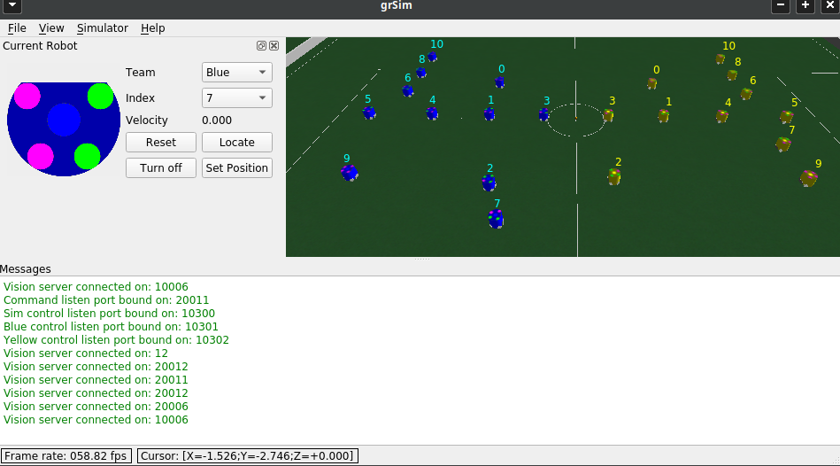
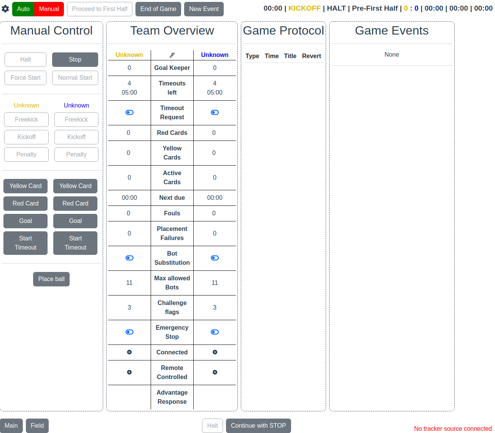
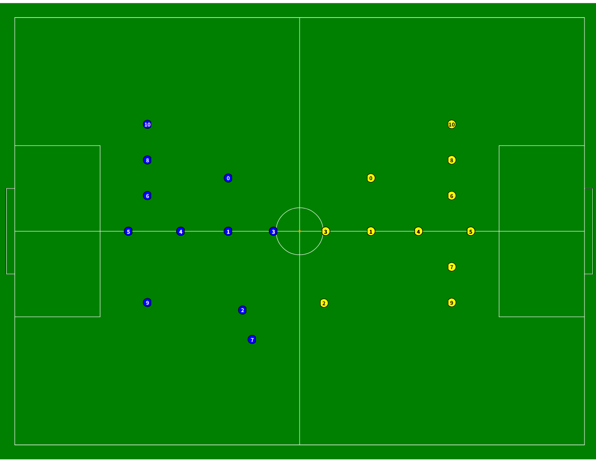
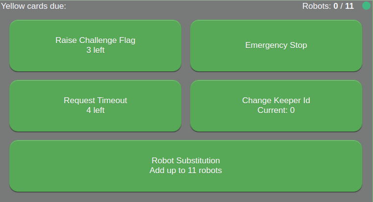

# Roots Docker Images

このリポジトリでRootsが使用するDockerfileを管理します

## Requirements

GUIアプリケーションを実行する場合は
[osrf/rocker](https://github.com/osrf/rocker)
の使用を推奨します。

ROS 環境を設定後、`sudo apt-get install python3-rocker`でインストールできます

## grSim

[RoboCup-SSL/grsim](https://github.com/RoboCup-SSL/grSim)
を実行するためのDockerfile

ホストにgrSimの設定ファイルを生成

```sh
touch .grsim.xml
```

設定ファイルをコンテナにマウントして、grSimを起動

```sh
rocker --x11 --net=host --volume .grsim.xml:/root/robocup/.grsim.xml -- \
ghcr.io/ssl-roots/docker_images/grsim:main ./grSim
```



clientを起動

```sh
rocker --x11 --net=host grsim:latest ./client
```


# Other docker images

## ssl-game-controller

[RoboCup-SSL/ssl-game-controller](https://github.com/RoboCup-SSL/ssl-game-controller)

```sh
$ docker run --net=host robocupssl/ssl-game-controller
$ google-chrome http://localhost:8081
```



## ssl-vision-client

[RoboCup-SSL/ssl-vision-client](https://github.com/RoboCup-SSL/ssl-vision-client)

デフォルトポート設定：
https://github.com/RoboCup-SSL/ssl-vision-client/blob/01d57d8b1afaa724ce335ad9dd17c35498d4a121/cmd/ssl-vision-client/main.go#L15-L19

```sh
$ docker run --net=host robocupssl/ssl-vision-client
$ google-chrome http://localhost:8082
```



## ssl-remote-control

[RoboCup-SSL/ssl-remote-control](https://github.com/RoboCup-SSL/ssl-remote-control)

```sh
$ docker run --net=host robocupssl/ssl-remote-control -team BLUE
$ google-chrome http://localhost:8083
```




## ER-Force's Auto Referee

[robotics-erlangen/autoref](https://github.com/robotics-erlangen/autoref)

```sh
$ docker run --net=host roboticserlangen/autoref:latest
```
